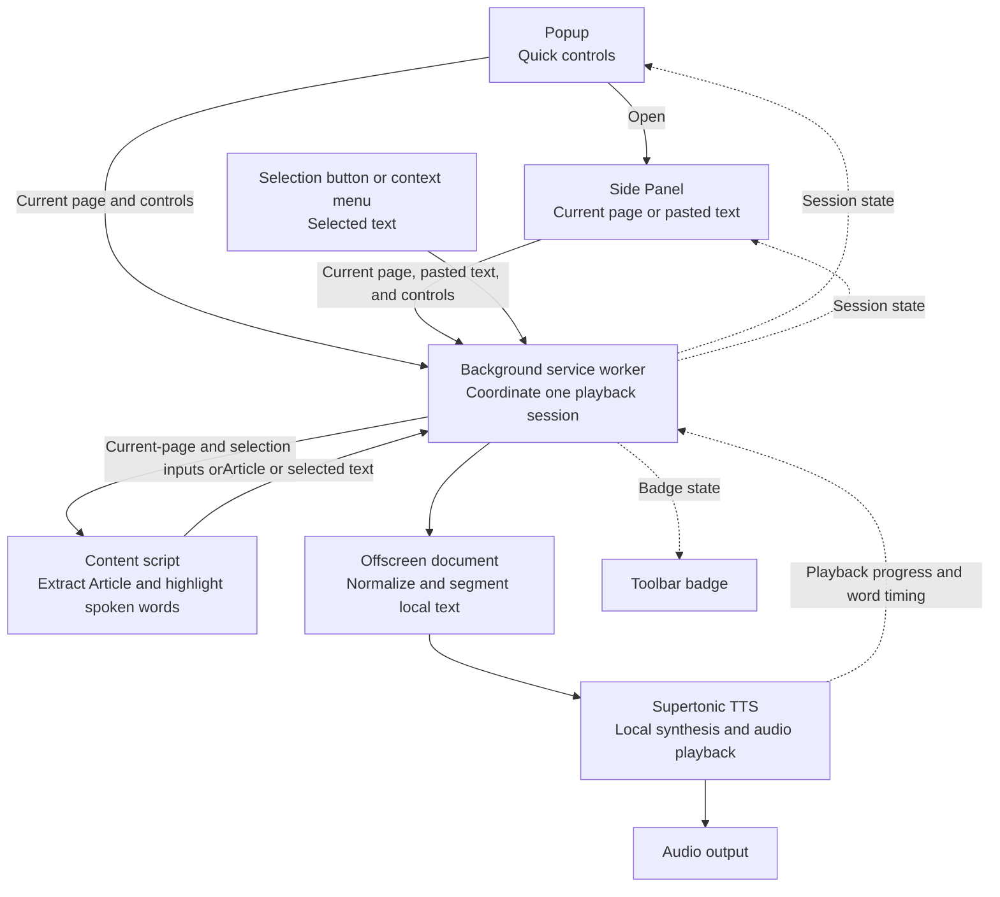

# readit.dev

`readit.dev` is a free Chrome extension that reads the current web page aloud with on-device Text-to-Speech (TTS). The current extension release uses the local Supertonic WASM/WebGPU engine; the backend folder is reserved for future Pro features and is not used by the Free release.

## Technology

- **Frontend (Chrome Extension)**: React 19, TypeScript 6, Rsbuild, and Supertonic TTS running through ONNX Runtime Web.
- **Future Pro backend**: Hono, Cloudflare Workers, and Cloudflare D1 (SQLite at the edge).

## How it works



The Free extension keeps Article and pasted-text processing and speech synthesis on the user's device. Pasted text passes only between
extension contexts for playback and is never written to extension storage.

## Quick start

This monorepo uses `pnpm v11`.

```bash
pnpm install
```

## Local development

### Extension

```bash
pnpm dev
```

After the build completes:

1. Open `chrome://extensions/` in Chrome.
2. Enable **Developer mode**.
3. Choose **Load unpacked** and select the repository's `dist/` directory.

### Backend

```bash
pnpm --filter readit-backend dev
```

This starts the local Cloudflare Worker with the local D1 database configuration.

## Build and deployment commands

- **Build the extension**: `pnpm build`
- **Run unit tests**: `pnpm test:unit`
- **Run end-to-end tests**: `pnpm test:e2e`
- **Deploy the backend**: `pnpm --filter readit-backend deploy`

## Documentation

- [Product Requirements Document](./_docs/PRD.md)
- [Free MVP Design Specification](./_docs/specs/2026-07-12-free-mvp-design.md)
- [Deployment Guide](./_docs/DEPLOYMENT.md)
- [Release Guide](./_docs/RELEASING.md)
- [Architecture Decision Record](./_docs/adr)
- [Privacy Policy](https://tunglt1810.github.io/readit.dev/privacy-policy/)
- [Third-Party Notices](./public/THIRD_PARTY_NOTICES.txt)

## License

This project is licensed under the GNU Affero General Public License v3.0 or later. See [LICENSE](./LICENSE) for the complete terms.
