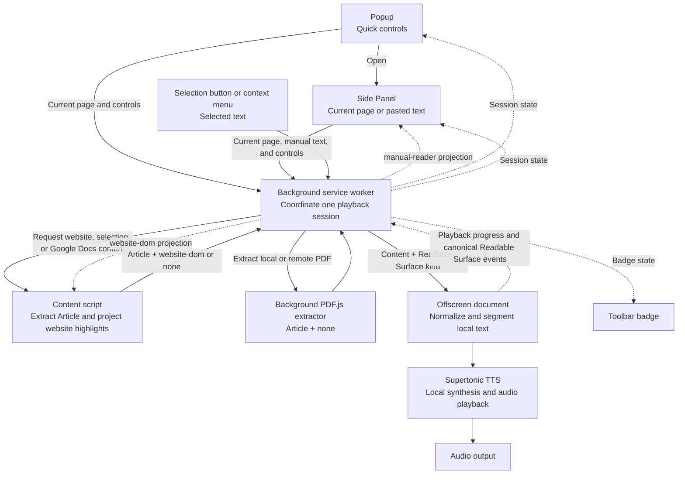

# readit.dev

`readit.dev` is a free Chrome extension that reads the current web page aloud with on-device Text-to-Speech (TTS). The current extension release uses the local Supertonic WASM/WebGPU engine; the backend folder is reserved for future Pro features and is not used by the Free release.

## Technology

- **Frontend (Chrome Extension)**: React 19, TypeScript 6, Rsbuild, and Supertonic TTS running through ONNX Runtime Web.
- **Future Pro backend**: Hono, Cloudflare Workers, and Cloudflare D1 (SQLite at the edge).

## How it works


```mermaid
flowchart TD
	A["Popup<br/>Quick controls"] -->|Open| C["Side Panel<br/>Current page or pasted text"]
	A -->|Current page and controls| B["Background service worker<br/>Coordinate one playback session"]
	C -->|Current page, manual text, and controls| B
	D["Selection button or context menu<br/>Selected text"] --> B
	B -->|Request website, selection, or Google Docs content| E["Content script<br/>Extract Article and project website highlights"]
	E -->|Article + website-dom or none| B
	B -->|Extract local or remote PDF| P["Background PDF.js extractor<br/>Article + none"]
	P --> B
	B -->|Content + Readable Surface kind| F["Offscreen document<br/>Normalize and segment local text"]
	F --> G["Supertonic TTS<br/>Local synthesis and audio playback"]
	G --> H["Audio output"]
	F -. Playback progress and canonical Readable Surface events .-> B
	B -. website-dom projection .-> E
	B -. manual-reader projection .-> C
	B -. Session state .-> A
	B -. Session state .-> C
	B -. Badge state .-> I["Toolbar badge"]
```

Successful extraction returns both an Article and an explicit Readable Surface capability. Every Playback Session stores one of three
surface kinds:

- `website-dom` projects spoken-word updates into the source page through the content script.
- `manual-reader` projects updates into the Side Panel's locked pasted-text reader.
- `none` keeps Google Docs export and PDF playback text-only because those sources do not currently expose a supported projection surface.

The offscreen document emits one canonical initialize/update/clear protocol. The background Readable Surface coordinator validates events
against the active session, coalesces website updates, and routes them to the matching surface without coupling speech synthesis to a
specific UI.

The Free extension keeps Article and pasted-text processing and speech synthesis on the user's device. Pasted text passes only between
extension contexts for playback and is never written to extension storage.

## Domain language

| Term | Meaning |
| --- | --- |
| **Article** | Titled text extracted from a tab for current-page or selected-text playback. |
| **Content Source** | Origin from which readable text is obtained: website, Google Docs export, PDF, selection, or manual input. |
| **Readable Surface** | User-visible text that can project the current spoken position, or explicitly has no projection. |
| **Playback Session** | Single active reading lifecycle that owns content, progress, voice settings, and its Readable Surface. |
| **Manual Reader** | Side Panel text area that owns pasted-text playback independently of tab lifecycle. |

A website Article or selection uses the page DOM as its Readable Surface. The Manual Reader is both a Content Source and a Readable
Surface. Google Docs and PDF are Content Sources without a source-view Readable Surface today. Use **Content Source** for extraction origin;
use Playback Session ownership for runtime lifecycle.

## Quick start

This monorepo uses `pnpm v11`.

```bash
pnpm install
```

## Local development

### Extension

```bash
pnpm dev
```

After the build completes:

1. Open `chrome://extensions/` in Chrome.
2. Enable **Developer mode**.
3. Choose **Load unpacked** and select the repository's `dist/` directory.

### Backend

```bash
pnpm --filter readit-backend dev
```

This starts the local Cloudflare Worker with the local D1 database configuration.

## Build and deployment commands

- **Build the extension**: `pnpm build`
- **Run unit tests**: `pnpm test:unit`
- **Run end-to-end tests**: `pnpm test:e2e`
- **Deploy the backend**: `pnpm --filter readit-backend deploy`

## Documentation

- [Product Requirements Document](./docs/PRD.md)
- [Free MVP Design Specification](./docs/specs/2026-07-12-free-mvp-design.md)
- [Readable Surface Architecture](./docs/specs/2026-07-28-readable-surface-architecture-design.md)
- [Deployment Guide](./docs/DEPLOYMENT.md)
- [Release Guide](./docs/RELEASING.md)
- [Architecture Decision Record](./docs/adr)
- [Privacy Policy](https://tunglt1810.github.io/readit.dev/privacy-policy/)
- [Third-Party Notices](./public/THIRD_PARTY_NOTICES.txt)

## License

This project is licensed under the GNU Affero General Public License v3.0 or later. See [LICENSE](./LICENSE) for the complete terms.
