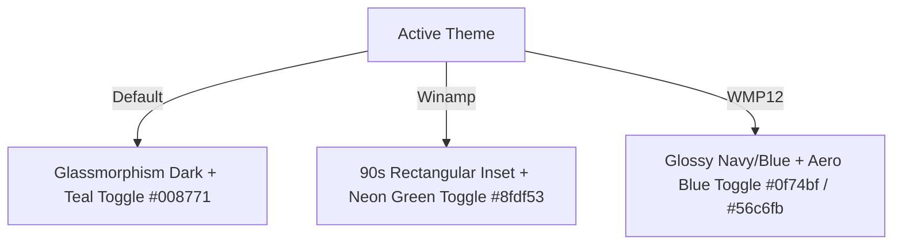

# Design Specification: Settings Card Redesign & Side Panel Integration

**Created Date**: 2026-07-26  
**Updated Date**: 2026-07-26 (Refined Inline Rows, Localization & WMP12 Theme Polish)  
**Branch**: `main`  

---

## 1. Goals
1. **Unified Configuration Card**: Consolidate all configuration options (`Voice`, `Speed`, `Selection Button`, `Word Highlight`, `Theme`) into a single reusable Settings Card titled `"Configuration"`.
2. **Consistent Inline Layout**: Render all setting items as uniform inline rows (`display: flex; justify-content: space-between; align-items: center;`) with consistent typography, eliminating redundant inner border boxes and bloated vertical padding.
3. **Inline Select & Slider**: Convert `Select Voice` and `Reading Speed` controls into compact inline controls aligned to the right side of their respective setting rows.
4. **Side Panel Integration & Placement**: Position the collapsible Settings Card at the bottom of the Side Panel (immediately above the player footer) and place the playback status indicator (`"Ready to read page"`) at the top inside the Current Page Card.
5. **Theme Styling Consistency**: Ensure toggle switches, sliders, and dropdowns seamlessly inherit theme styles (`Default`, `Winamp`, `WMP12`).
6. **Full Localization**: Support 100% localization via `t(...)` across English (`en`) and Vietnamese (`vi`).

---

## 2. Component & Layout Design

### 2.1 Settings Card Component (`SettingsCard.tsx`)
A unified React component used across Popup and Side Panel:
- **Header**: Displays title `t('voiceConfig')` ("Configuration" / "Cấu hình") with an optional collapse toggle arrow (▲/▼).
- **Inline Setting Rows**:
  1. `Select Voice`: `Select Voice` + `<select className="form-select inline-select">`
  2. `Reading Speed`: `Reading Speed (1.05x)` + `<input type="range" className="form-slider inline-slider">`
  3. `Show Selection Button`: `Show read button for selected text` + `<input type="checkbox" className="selection-button-toggle">`
  4. `Show Word Highlight`: `Highlight the word being read on the page` + `<input type="checkbox" className="selection-button-toggle">`
  5. `Select Theme`: `Select Theme` + `<button className="theme-selector-btn">`

### 2.2 Theme Toggle & Control Rules

1. **Default Theme (Glassmorphic Dark)**:
   - Card background: `rgba(18, 18, 24, 0.78)` with `backdrop-filter: blur(12px)`.
   - Toggle switch: Rounded pill shape with brand teal `#008771` active track.
2. **Winamp Theme (Retro 90s)**:
   - Card background: `#020303` with 2px retro inset border `#060606 #8d8d8d #8d8d8d #060606`.
   - Toggle switch: Sharp square retro track with neon green `#8fdf53` active indicator and monospace typography `#71ea64`.
3. **WMP12 Theme (Windows Media Player 12)**:
   - Card background: Glossy dark navy `rgba(16, 21, 23, 0.85)` with metallic slate border `#43525b`.
   - Toggle switch: Rounded metallic track with Aero blue `#0f74bf` / `#56c6fb` active gradient.

---

## 3. Side Panel Structure & Status Placement
- **Top Card**: Current Page Card contains the status display (`.status-display`) at the top.
- **Middle Section**: Or Paste Text Card for manual text reading.
- **Bottom Section**: Reusable Collapsible Settings Card placed with `margin-top: auto` right above the Sticky Player Footer.
